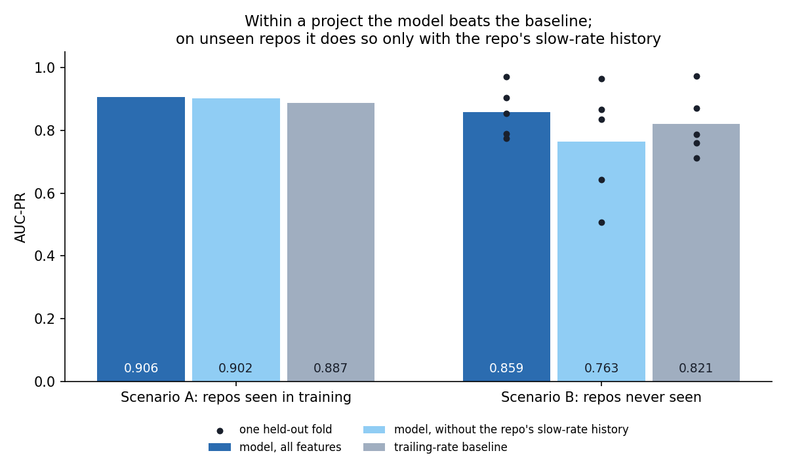
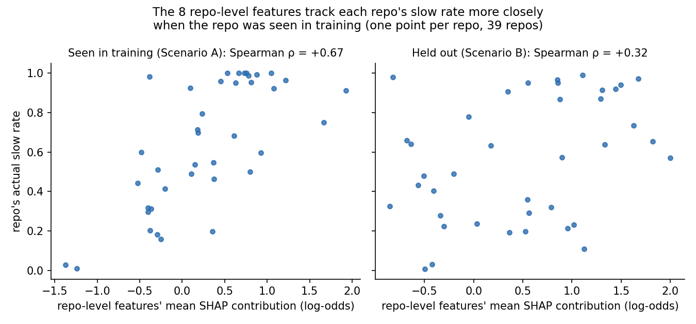

# PRFlowPredict: predicting which pull requests will stall

Every measured result in this report is checked by `tests/test_writeup_claims.py` against the
committed data file or phase report it comes from, and the test fails if a number here is
wrong or stale.

## 1. The problem, and why a rule is not enough

A pull request that waits a week for its first review is a small failure that compounds:
contributors lose context, rebase against a moving target, and some may not come back.
PRFlowPredict scores each PR **at the moment it is opened**, using only information that
existed at that moment, and ranks a repo's open PRs by their risk of waiting more than 168
hours (7 days) for a first human review.

A simple rule such as "flag anything open more than 3 days" ignores that normal wait time
varies enormously by repo, by author history and by current backlog. Three days is alarming
in one project and routine in another. A model can learn what "normal" means per context.

PR and code-review latency has a research literature (search terms: *pull request latency
prediction*, *code review time prediction*). This project's angle is deliberately cautious:
PRs that are never reviewed stay in the label rather than being dropped; within-project and
cold-start performance are reported separately, never just the flattering one; and a
baseline the model must beat is fixed in advance.

## 2. Data

**Cohort.** Public repos stratified by language (Python, TypeScript, Go) and star tier
(200-800, 800-3,000, 3,000-15,000), five per cell, drawn at random with a fixed seed from a
persisted candidate pool. Pre-registered structural checks, which never used the label,
kept 39 of the 45 repos collected: five were dominated by bot-authored PRs and one did not
match its language stratum. The modelling rows are human-authored PRs opened from 1 January
2024 to 30 June 2026: 38,462 modelling rows.

**Collection.** GitHub's GraphQL API, in two stages and two tiers.
- **Two stages.** Raw response bytes are written to disk verbatim, and parsed into Parquet
  by a separate offline step. A parse bug therefore costs a re-parse, never a re-scrape. That
  paid off once: a parse bug that turned legitimate zeros into missing values was found
  during feature engineering and fixed by re-parsing.
- **Two tiers.** Every PR in each repo's *entire* history is collected thinly, and PRs in the
  modelling window richly. The window is a row filter, not a collection filter, because
  backlog and author-history features need everything that happened before it.

**The label.** A PR is *slow* if no one other than its author, and no bot, reviews or
comments on it within 168 hours of creation. The primary definition (D5) also ignores
commenters whose relationship to the repo is `NONE`: a pilot on `anthropics/skills` showed
an apparent spam account commenting on outsiders' PRs, which would otherwise count as a review. The
label is 46.4% slow under D5 and 44.0% under D3, the variant that keeps those commenters; the
full five-definition table is in [the Phase 2 report](phase2_eda.md). More detail on the
collection design is in [how the data was collected](data_collection.md).

## 3. Leakage prevention

Leakage is the main way a project like this produces a result that looks good and means
nothing, so it is prevented structurally rather than checked for afterwards.

- **Chronological replay.** History features are computed by replaying each repo's events in
  time order, from state that existed strictly before the PR was opened.
- **"Resolvable by t" for label-derived features.** A repo's trailing slow rate at time *t*
  may only use PRs whose own label was already knowable at *t*: created at least 168 hours
  earlier, or already reviewed. Using every earlier PR, the obvious rule, silently looks up to
  seven days into the future.
- **Snapshots versus point-in-time values.** Some API fields (final diff size, draft status,
  labels) describe the PR *now*, not when it was opened. Where possible the at-open value is
  reconstructed from the timeline; fidelity flags recording how well that worked are kept as
  columns and never used as features. A field shown to change after the fact (the author's
  association with the repo) is excluded.
- **An independent audit.** Every replayed feature was recomputed by a separate brute-force
  implementation on a seeded sample of 500 rows, largest difference 0.0, and five rows were
  checked by hand against live GitHub.

## 4. Evaluation design

- **Scenario A, within-project.** The same 39 repos, split in time: train on PRs opened
  before 1 January 2026, test on PRs opened after.
- **Scenario B, cold-start.** Leave-repos-out: five folds, each holding out about eight whole
  repos the model never sees in training. Every repo is held out exactly once.
- **Metrics.** Precision@10 per repo, the share of slow PRs among the 10 a maintainer would
  look at first, averaged over repos; and AUC-PR, which does not depend on how many
  candidates each repo has.
- **Baseline.** Rank each repo's PRs by the repo's own trailing 90-day slow rate, computed
  with the same resolvable-by-*t* rule. The model has to beat this, not just chance.
- **Intervals.** A cluster bootstrap that resamples whole repos (2,000 draws). The effective
  sample size for a claim about repos is the number of repos, not the number of PRs.
- **Model.** LightGBM, trained deterministically (fixed seeds, single thread). Hyperparameters
  were tuned with Optuna on Scenario A's training rows only, in time-ordered folds, reaching a
  cross-validated AUC-PR 0.907. Scenario A's test period never influenced tuning. Scenario B's
  held-out repos did: their pre-2026 rows are part of Scenario A's training rows, since every
  repo is held out in some fold. The same hyperparameters were then frozen for every run, so
  the effect is likely small, but it was not measured.

## 5. Results

| | Scenario A | Scenario B |
|---|---|---|
| P@10, model | 0.769 [0.669, 0.856] | 0.796 [0.614, 0.939] |
| P@10, trailing-rate baseline | 0.585 | 0.632 |
| AUC-PR, model | 0.906 | 0.859 |
| AUC-PR, trailing-rate baseline | 0.887 | 0.821 |

Scenario B's numbers are means over its five folds; its P@10 interval is the mean of the five
folds' bootstrap interval bounds, not one pooled bootstrap.

**Within a project, the model clearly works.** On Scenario A its precision@10 is
0.769 [0.669, 0.856], +0.185 over the baseline, and the baseline scores 0.585, outside the
interval. It also clears the base rate of 0.641, the precision a random pick would get.

**Do not read Scenario B's higher P@10 as cold-start being easy.** Scenario B's P@10 is higher
than Scenario A's, but that is a pool-size artifact. P@10 picks the top 10 *per repo*, and
Scenario A draws them from a median of 64 test PRs per repo, against 433 in Scenario B.
Picking 10 slow PRs out of a larger pool is easier. AUC-PR does not depend on pool size, so it
is the fair comparison across scenarios.

**Across projects, the advantage comes from the repo's slow-rate history.** The pre-registered
ablations remove one group of features at a time (AUC-PR):

| Features | Scenario A | Scenario B |
|---|---|---|
| FULL | 0.906 | 0.859 |
| NO_SNAPSHOT | 0.908 | 0.853 |
| NO_LABEL_REPLAY | 0.902 | 0.763 |
| PR_ONLY | 0.729 | 0.556 |
| trailing-rate baseline | 0.887 | 0.821 |

`NO_LABEL_REPLAY` removes the four features that replay the repo's own review record, such as
its trailing slow rate and the author's past slow rate in the repo. Within a project, the model
barely notices and still beats the baseline: the remaining features (the PR itself, the
author's and the repo's other history, the repo's attributes) carry real signal. Across
projects, the same ablation drops it to 0.763 vs 0.821, below the baseline, in 4 of 5 folds.
With the slow-rate features the cold-start model beats the baseline (0.859 vs 0.821); without
them it does not. In this cohort, what the model learns from the remaining features in some
projects does not carry to others.

On per-repo P@10 the same ablation still edges the baseline on unseen repos (0.699 vs 0.632),
but its fold-averaged interval [0.469, 0.906] cannot separate the two. AUC-PR is global across
all test rows, so it mostly rewards telling slow repos from fast ones (see
[the Phase 4 report](phase4_results.md)), and that is what the ablation loses.

## 6. Why doesn't it transfer?



**Phase 6: it is not that the model relies on different features.** Exact TreeSHAP
attributions for both full models show the four history features carrying 60.9% in Scenario A
and 63.1% in Scenario B of the models' mean absolute attribution: essentially the same. A single feature,
the author's past slow rate in the repo, carries 47.3% and 46.8% respectively. The cold-start
model does not fail because it leans on different things. One caveat applies: this compares
the two full models, while the failure is specific to the ablation without history features.
See [the Phase 6 report](phase6_interpretation.md).

**Phase 6b: a pre-registered test of one mechanism, repo fingerprinting.** Without its history
features, might the model use eight repo-level attributes that are constant within a repo
(maintainer counts, whether it has a CODEOWNERS file, its CI workflow count and so on) to
*recognise* repos and replay their base rates? That would work on repos seen in training and
mean nothing on unseen ones. The hypothesis is post-hoc: it came from an exploratory look at
feature importance. It was then tested under a decision rule
[committed before any code](superpowers/specs/2026-09-24-phase6b-fingerprinting-design.md),
with two tests that both had to confirm it for "supported":

- **A SHAP transfer test.** For each repo, compare the attribution those eight features give it
  with its actual slow rate. On repos seen in training ρ_A = +0.669; on held-out repos
  ρ_B = +0.318. The difference is T = +0.351, 95% CI [+0.092, +0.616], which lies above zero:
  **confirms**.
- **An intervention.** Retrain without the eight features and measure the change in AUC-PR:
  Δ_A = -0.040 within a project, Δ_B = -0.004 on unseen repos. Fingerprinting predicts removal
  should hurt the seen repos more; the difference is I = +0.035, 95% CI [-0.043, +0.106], which
  contains zero: **inconclusive**.

The verdict is `PARTIAL_SHAP_ONLY`. The attribution pattern is there: the eight features carry
30.3% of mean |SHAP| in Scenario A and 40.7% in Scenario B, and their contribution tracks a
repo's real slow rate more closely when the repo was seen in training. But removing them does
not measurably hurt seen repos more than unseen ones, so the pattern is not shown to be what
costs cold-start accuracy.



Two caveats keep this from being read too strongly:
- **ρ_B was predicted to be about zero, and is not.** The observed ρ_B = +0.318 is not the ≈0
  the pre-registration predicted, but its descriptive bootstrap interval, about [0.00, 0.57],
  makes it only marginally distinguishable from it. That interval is descriptive, outside the
  pre-registered verdict.
- **The intervention's per-fold effects are unstable.** Per-fold changes on unseen repos range
  from +0.245 to -0.131, and I's 95% interval [-0.043, +0.106] contains zero: this data
  cannot distinguish a small intervention effect from none.

See [the Phase 6b report](phase6b_fingerprinting.md).

## 7. Fairness

A triage tool that systematically under-ranks newcomers' PRs would compound an existing
open-source problem. The question is whether the model is *differentially* pessimistic about
first-time contributors: the paired difference between the newcomer gap (predicted minus
actual slow rate) and the repeat-contributor gap, within the same repos.

- **Scenario A:** -0.003, 95% CI [-0.091, 0.090]. No distinguishable newcomer penalty.
- **Scenario B:** +0.064, 95% CI [-0.010, 0.143]. The interval contains zero, but its lower
  bound sits just below it: a marginal null, which neither confirms nor rules out a penalty.
  On its own, the newcomer slice in Scenario B *is* over-predicted as slow, at
  +0.067, 95% CI [0.002, 0.136].

## 8. What didn't work, and limitations

- **The cold-start bar was never measured.** The project plan set a Scenario B bar of a
  C-index above 0.65, to come from a survival model. That phase was not built, so the bar was
  never measured. The cold-start evidence here is the AUC-PR ablation above.
- **39 repos is a small sample** for any claim about projects in general. Cold-start results
  swing widely between folds: without the history features, per-fold AUC-PR runs
  from 0.507 to 0.965.
- **Snapshot repo attributes.** Maintainer counts, CODEOWNERS and similar features are 2026
  snapshots applied to PRs from 2024 onward, and star tiers are defined by 2026 star counts.
- **What was tried.** All 36 runs are logged in [data/experiments.csv](../data/experiments.csv),
  including the ablations that did not help: dropping snapshot features changed little
  anywhere, and PR-level features alone fall far below the baseline in both scenarios.
- **Lessons from the process.**
  - A test once overwrote a model file in a gitignored directory, where version control could
    not see it. It was restored and verified exactly, and the test file that reached it now
    redirects those directories to a temporary one. Verify gitignored artifacts by hash, never by version-control status.
  - Several tests were found whose assertions held whether or not the behaviour they named
    worked. Tests are now checked by deliberately breaking the code they cover and confirming
    they fail.

## 9. How it was built

- **Validity gates, pre-registered.** Every phase wrote its pass criteria down before its
  results were read: disjoint splits, no label or key column in any feature set, reproducible
  refits, exact attribution additivity. The gates test that a result is *valid*, never that it
  is good. A disappointing result that passes its gate is reported as found.
- **A pre-registered hypothesis test.** Phase 6b's decision rule, nine outcomes from two tests,
  was committed before any code existed, and the result was reported in whichever cell it
  landed.
- **Mutation-checked tests.** Tests are verified by breaking the code they cover and confirming
  they fail.
- **Review before merge.** From Phase 2 on, each phase was built on its own branch and
  reviewed against its written spec before it was merged.
- **Checkable from committed artifacts.** Both headline figures are regenerated from committed
  data, and every measured result in this report is recomputed from committed data or read
  from a committed phase report, then checked by the test suite.

## 10. Reproducing it

From the committed state, with no GitHub access:

```bash
pip install -r requirements.txt
python -m pytest tests -q        # includes the check of every number in this report
python writeup_figures.py        # regenerates both headline figures
```

The full pipeline needs a GitHub token and a multi-hour collection, because raw data is not
committed:

```bash
gh auth login
python collect_cohort.py         # ~4-5 h, resumable
python parse.py
python cohort_qc.py
python eda_report.py
python baseline.py
python features.py
python features.py --audit
python tune.py
python experiment.py
python report4.py
python report6.py
python report6b.py
```

Re-running some steps overwrites committed results:
- `baseline.py`, `experiment.py` and `report6b.py` append their runs to `data/experiments.csv`
  again, creating duplicate rows.
- `features.py --audit` rewrites `data/phase3_gate.json` with its automated checks only,
  dropping the recorded live-GitHub check (check 5).
- `report6.py` regenerates `docs/phase6_interpretation.md`, which replaces its hand-written
  error analysis.

The original plan is [the project blueprint](../actionable_ml_project_blueprint.md).
