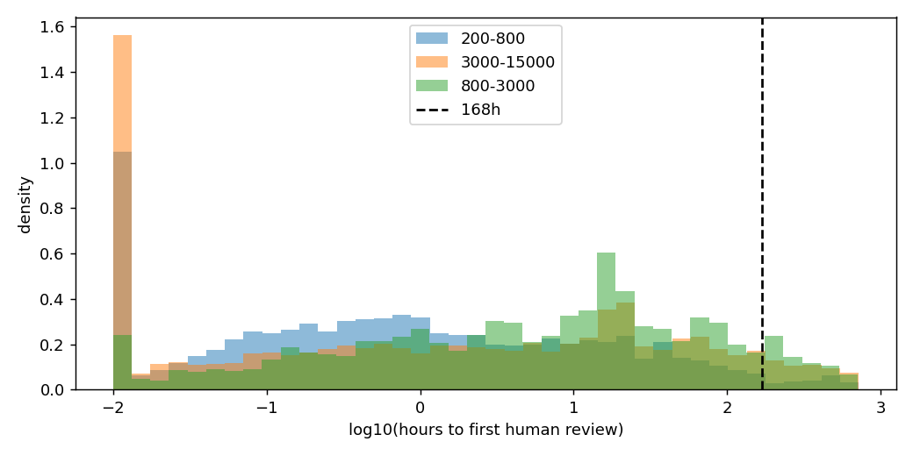
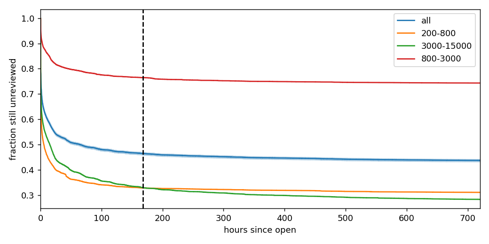

# Phase 2 — EDA and Gate

Generated by `eda_report.py`. Primary label: **D5**. Rows: human-authored,
in-window PRs from kept repos (38,462 PRs, 39 repos).

## Verdict: **PASS**

| id | check | value | pass |
|---|---|---|---|
| 1 | repos kept after QC >= 30 | 39 | True |
| 2 | D5 global is_slow in [10%, 70%] | 0.4639 | True |
| 3 | Scenario A: >= 20 test repos with >= 10 test PRs | 34 | True |
| 4 | Scenario B: every fold holds out >= 6 repos | 6 | True |
| 5 | replay audit: brute-force recomputation matches features_at on sampled test rows (else replay LEAKS) | [{'n': 200, 'max_abs_diff_rate': 0.0}, {'n': 200, 'max_abs_diff_rate': 0.0}] | True |
| 6 | gate_report refactor regression (tests/test_gate_regression.py) | run pytest | see pytest |

## 1. Cohort

| repo | cell | kept | reasons | n_in_window | n_human | bot_share | is_slow_d5 | is_slow_d3 | row_share | never_reviewed_d5 |
|---|---|---|---|---|---|---|---|---|---|---|
| mostly-ai/mostlyai | Python:200-800 | True |  | 691 | 684 | 0.010 | 0.654 | 0.651 | 0.018 | 0.643 |
| mmschlk/shapiq | Python:200-800 | True |  | 291 | 222 | 0.237 | 0.572 | 0.572 | 0.006 | 0.464 |
| pytest-dev/pytest-html | Python:200-800 | False | bot-authored share 82% > 50%; 37 human PRs < 100 | 200 | 37 | 0.815 | 0.595 | 0.568 | 0.000 | nan |
| dcs-liberation/dcs_liberation | Python:200-800 | True |  | 243 | 160 | 0.342 | 0.906 | 0.906 | 0.004 | 0.900 |
| Scottcjn/Rustchain | Python:200-800 | True |  | 5263 | 5180 | 0.016 | 0.199 | 0.125 | 0.135 | 0.185 |
| radixark/miles | Python:800-3000 | True |  | 1399 | 1398 | 0.001 | 0.641 | 0.634 | 0.036 | 0.572 |
| jhj0517/Whisper-WebUI | Python:800-3000 | True |  | 257 | 257 | 0.000 | 0.868 | 0.844 | 0.007 | 0.856 |
| michaelfeil/infinity | Python:800-3000 | True |  | 281 | 278 | 0.011 | 0.734 | 0.223 | 0.007 | 0.716 |
| huggingface/nanotron | Python:800-3000 | True |  | 271 | 270 | 0.004 | 0.633 | 0.626 | 0.007 | 0.581 |
| pytorch/audio | Python:800-3000 | True |  | 357 | 354 | 0.008 | 0.480 | 0.452 | 0.009 | 0.384 |
| icloud-photos-downloader/icloud_photos_downloader | Python:3000-15000 | True |  | 240 | 231 | 0.037 | 0.870 | 0.857 | 0.006 | 0.844 |
| ShishirPatil/gorilla | Python:3000-15000 | True |  | 785 | 784 | 0.001 | 0.361 | 0.358 | 0.020 | 0.253 |
| ostris/ai-toolkit | Python:3000-15000 | True |  | 289 | 289 | 0.000 | 0.913 | 0.824 | 0.008 | 0.896 |
| dbcli/mycli | Python:3000-15000 | True |  | 728 | 658 | 0.096 | 0.432 | 0.426 | 0.017 | 0.430 |
| microsoft/promptflow | Python:3000-15000 | True |  | 1869 | 1839 | 0.016 | 0.223 | 0.214 | 0.048 | 0.192 |
| metriport/metriport | TypeScript:200-800 | True |  | 3482 | 3469 | 0.004 | 0.110 | 0.110 | 0.090 | 0.082 |
| bastani-inc/atomic | TypeScript:200-800 | True |  | 1236 | 1119 | 0.095 | 0.970 | 0.969 | 0.029 | 0.969 |
| vscode-kubernetes-tools/vscode-kubernetes-tools | TypeScript:200-800 | False | bot-authored share 76% > 50% | 616 | 147 | 0.761 | 0.238 | 0.231 | 0.000 | nan |
| lexmin0412/dify-app-hub | TypeScript:200-800 | False | bot-authored share 77% > 50%; 72 human PRs < 100 | 318 | 72 | 0.774 | 0.861 | 0.861 | 0.000 | nan |
| antvis/GPT-Vis | TypeScript:200-800 | True |  | 309 | 219 | 0.291 | 0.233 | 0.233 | 0.006 | 0.215 |
| pingcap/autoflow | TypeScript:800-3000 | True |  | 464 | 462 | 0.004 | 0.779 | 0.777 | 0.012 | 0.764 |
| lnreader/lnreader | TypeScript:800-3000 | True |  | 335 | 295 | 0.119 | 0.637 | 0.637 | 0.008 | 0.559 |
| solana-foundation/solana-web3.js | TypeScript:800-3000 | True |  | 1614 | 947 | 0.413 | 0.320 | 0.317 | 0.025 | 0.297 |
| nteract/semiotic | TypeScript:800-3000 | True |  | 393 | 266 | 0.323 | 0.977 | 0.977 | 0.007 | 0.977 |
| projen/projen | TypeScript:800-3000 | True |  | 1188 | 1125 | 0.053 | 0.659 | 0.574 | 0.029 | 0.636 |
| didi/LogicFlow | TypeScript:3000-15000 | True |  | 290 | 285 | 0.017 | 0.239 | 0.239 | 0.007 | 0.151 |
| misskey-dev/misskey | TypeScript:3000-15000 | True |  | 2572 | 2054 | 0.201 | 0.326 | 0.324 | 0.053 | 0.280 |
| bia-pain-bache/BPB-Worker-Panel | TypeScript:3000-15000 | True |  | 331 | 331 | 0.000 | 0.940 | 0.900 | 0.009 | 0.934 |
| Zettlr/Zettlr | TypeScript:3000-15000 | False | bot-authored share 57% > 50% | 676 | 290 | 0.571 | 0.324 | 0.317 | 0.000 | nan |
| inversify/InversifyJS | TypeScript:3000-15000 | False | bot-authored share 62% > 50% | 274 | 103 | 0.624 | 0.932 | 0.922 | 0.000 | nan |
| kubernetes-sigs/gateway-api-inference-extension | Go:200-800 | True |  | 1978 | 1755 | 0.113 | 0.007 | 0.007 | 0.046 | 0.003 |
| VersusControl/versus-incident | Go:200-800 | True |  | 204 | 158 | 0.225 | 0.949 | 0.949 | 0.004 | 0.943 |
| charmbracelet/catwalk | Go:200-800 | True |  | 321 | 263 | 0.181 | 0.490 | 0.475 | 0.007 | 0.414 |
| kdlbs/kandev | Go:200-800 | True |  | 1434 | 1384 | 0.035 | 0.950 | 0.949 | 0.036 | 0.948 |
| argoproj-labs/gitops-promoter | Go:200-800 | True |  | 1511 | 758 | 0.498 | 0.215 | 0.032 | 0.020 | 0.181 |
| thought-machine/please | Go:800-3000 | True |  | 415 | 387 | 0.067 | 0.279 | 0.264 | 0.010 | 0.253 |
| yunionio/cloudpods | Go:800-3000 | True |  | 5237 | 5237 | 0.000 | 0.966 | 0.966 | 0.136 | 0.965 |
| stripe/stripe-go | Go:800-3000 | True |  | 521 | 264 | 0.493 | 0.193 | 0.186 | 0.007 | 0.170 |
| rabbitstack/fibratus | Go:800-3000 | True |  | 421 | 406 | 0.036 | 0.988 | 0.985 | 0.011 | 0.978 |
| rilldata/rill | Go:800-3000 | False | language 'TypeScript' not in stratum family ['Go'] | 5048 | 5038 | 0.002 | 0.154 | 0.153 | 0.000 | nan |
| kubernetes/autoscaler | Go:3000-15000 | True |  | 2746 | 2395 | 0.128 | 0.031 | 0.029 | 0.062 | 0.010 |
| benbjohnson/litestream | Go:3000-15000 | True |  | 433 | 433 | 0.000 | 0.570 | 0.554 | 0.011 | 0.497 |
| wader/fq | Go:3000-15000 | True |  | 465 | 464 | 0.002 | 0.918 | 0.918 | 0.012 | 0.916 |
| stakater/Reloader | Go:3000-15000 | True |  | 406 | 233 | 0.426 | 0.403 | 0.352 | 0.006 | 0.279 |
| crowdsecurity/crowdsec | Go:3000-15000 | True |  | 1376 | 1149 | 0.165 | 0.292 | 0.271 | 0.030 | 0.178 |

Look-at-these (not dropped): Scottcjn/Rustchain (row share 13%); michaelfeil/infinity (D3-D5 spread 51%); metriport/metriport (row share 9%); argoproj-labs/gitops-promoter (D3-D5 spread 18%); yunionio/cloudpods (row share 14%)

## 2. Label sensitivity

| definition | is_slow | never_reviewed_30d | median_wait_h |
|---|---|---|---|
| D1 | 0.583 | 0.554 | 1.770 |
| D2 | 0.583 | 0.554 | 1.771 |
| D3 | 0.440 | 0.413 | 0.747 |
| D4 | 0.440 | 0.413 | 0.748 |
| D5 | 0.464 | 0.437 | 1.138 |

Per-repo |D3 − D5| spread: median 0.003, max 0.511
(michaelfeil/infinity).

Limitation: commenter `author_association` is read-time-computed (proven for PR authors in
Phase 0), so D5 slightly over-counts reviews relative to true at-the-time standing.

## 3. Wait-time distribution

## 4. Kaplan–Meier: fraction still unreviewed

## 5. Threshold sensitivity

| tier | threshold_h | is_slow |
|---|---|---|
| 200-800 | 72 | 0.351 |
| 3000-15000 | 72 | 0.375 |
| 800-3000 | 72 | 0.787 |
| all | 72 | 0.493 |
| 200-800 | 120 | 0.336 |
| 3000-15000 | 120 | 0.346 |
| 800-3000 | 120 | 0.771 |
| all | 120 | 0.474 |
| 200-800 | 168 | 0.328 |
| 3000-15000 | 168 | 0.329 |
| 800-3000 | 168 | 0.765 |
| all | 168 | 0.464 |
| 200-800 | 240 | 0.324 |
| 3000-15000 | 240 | 0.315 |
| 800-3000 | 240 | 0.756 |
| all | 240 | 0.455 |

Recommendation: keep 168h unless the curve shows a natural break elsewhere.

## 6. Baseline (trailing-90d slow rate)

| scenario | fold | n_test_repos | precision_at_10 | p10_ci_lo | p10_ci_hi | base_rate_p10 | auc_pr | base_rate |
|---|---|---|---|---|---|---|---|---|
| A | 0 | 39 | 0.582 | 0.467 | 0.690 | 0.641 | 0.887 | 0.481 |
| B | 0 | 6 | 0.667 | 0.433 | 0.867 | 0.578 | 0.971 | 0.810 |
| B | 1 | 7 | 0.600 | 0.371 | 0.829 | 0.561 | 0.765 | 0.371 |
| B | 2 | 8 | 0.750 | 0.613 | 0.850 | 0.637 | 0.759 | 0.416 |
| B | 3 | 9 | 0.478 | 0.267 | 0.689 | 0.444 | 0.763 | 0.218 |
| B | 4 | 9 | 0.700 | 0.466 | 0.900 | 0.605 | 0.871 | 0.512 |

P@10 vs base rate is REPORTED, not gated: the trailing rate varies within a repo over
time, so within-repo top-10 selects PRs from the slowest period and can beat the base
rate through temporal autocorrelation alone. Leakage is tested directly by the replay
audit (gate #5).
