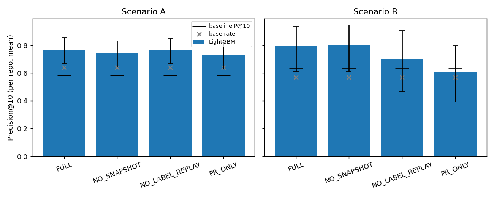
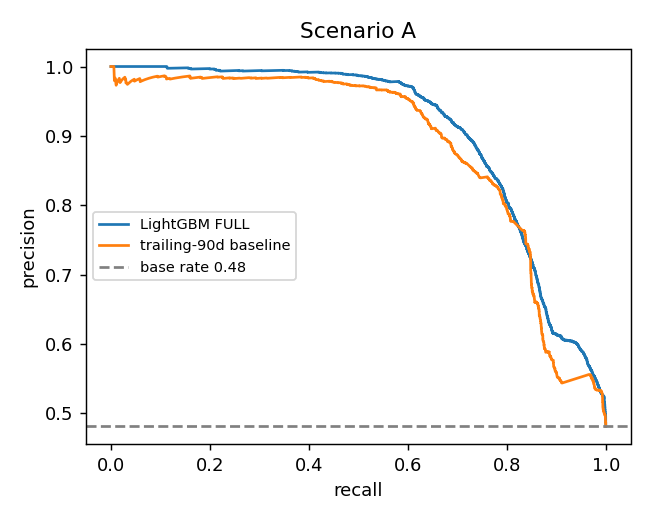
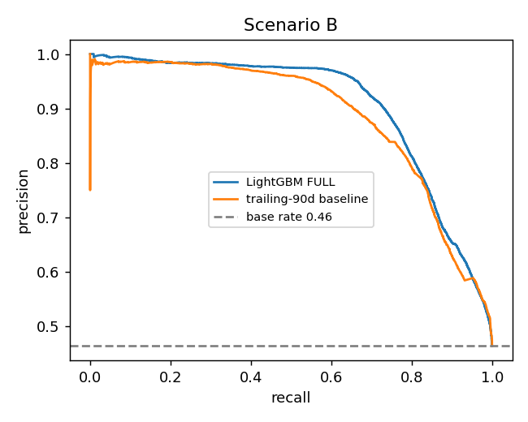

# Phase 4 — LightGBM Results

Generated by `report4.py`. Params sha `172a16888cca`. Rows: 38,444 (18 truncated-timeline rows dropped).

## Gate: **PASS** (validity, not success)

| id | check | value | pass |
|---|---|---|---|
| 1 | splits disjoint: A by time (train < cutoff <= test), B by repo per fold | ok | True |
| 2 | no key/label/flag column in any feature set | ok | True |
| 3 | NO_LABEL_REPLAY ran on both scenarios | ["('A', 'FULL')", "('A', 'NO_LABEL_REPLAY')", "('A', 'NO_SNAPSHOT')", "('A', 'PR_ONLY')", "('B', 'FULL')", "('B', 'NO_LABEL_REPLAY')", "('B', 'NO_SNAPSHOT')", "('B', 'PR_ONLY')"] | True |
| 4 | all 24 runs have bootstrap CIs and are in experiments.csv under params sha | {'runs': 24, 'logged': 24, 'ci_ok': True} | True |
| 5 | refit A/FULL from params.json reproduces AUC-PR (|delta| < 1e-6) | 0.00e+00 | True |

## 1. Setup

Tuned on Scenario A training rows, `TimeSeriesSplit(3)`, 100 Optuna trials, CV AUC-PR **0.9070**.
Params (frozen for every scenario, fold and ablation — ablations are therefore compared under identical settings, not re-tuned):

```
{
  "num_leaves": 128,
  "learning_rate": 0.011085580440639129,
  "n_estimators": 234,
  "min_child_samples": 82,
  "feature_fraction": 0.9976612970486801,
  "bagging_fraction": 0.5368729535602461,
  "lambda_l2": 0.0011367178302322922,
  "bagging_freq": 1
}
```

## 2. Scenario A (known-project, time cutoff 2026-01-01)

| featureset | precision_at_10 | p10_ci_lo | p10_ci_hi | baseline_p10 | base_rate_p10 | auc_pr | baseline_auc_pr |
|---|---|---|---|---|---|---|---|
| FULL | 0.769 | 0.669 | 0.856 | 0.585 | 0.641 | 0.906 | 0.887 |
| NO_SNAPSHOT | 0.744 | 0.644 | 0.831 | 0.585 | 0.641 | 0.908 | 0.887 |
| NO_LABEL_REPLAY | 0.767 | 0.669 | 0.851 | 0.585 | 0.641 | 0.902 | 0.887 |
| PR_ONLY | 0.731 | 0.631 | 0.821 | 0.585 | 0.641 | 0.729 | 0.887 |

## 3. Scenario B (cold-start, leave-repos-out, 5 folds; means over folds)

| featureset | n_folds | precision_at_10 | p10_ci_lo | p10_ci_hi | baseline_p10 | base_rate_p10 | auc_pr | baseline_auc_pr |
|---|---|---|---|---|---|---|---|---|
| FULL | 5 | 0.796 | 0.614 | 0.939 | 0.632 | 0.568 | 0.859 | 0.821 |
| NO_SNAPSHOT | 5 | 0.804 | 0.614 | 0.947 | 0.632 | 0.568 | 0.853 | 0.821 |
| NO_LABEL_REPLAY | 5 | 0.699 | 0.469 | 0.906 | 0.632 | 0.568 | 0.763 | 0.821 |
| PR_ONLY | 5 | 0.609 | 0.392 | 0.796 | 0.632 | 0.568 | 0.556 | 0.821 |

FULL per fold:

| fold | n_test_repos | precision_at_10 | p10_ci_lo | p10_ci_hi | baseline_p10 | base_rate_p10 | auc_pr | baseline_auc_pr |
|---|---|---|---|---|---|---|---|---|
| 0.000 | 6.000 | 0.883 | 0.733 | 0.983 | 0.650 | 0.635 | 0.971 | 0.973 |
| 1.000 | 7.000 | 0.900 | 0.757 | 0.986 | 0.629 | 0.627 | 0.790 | 0.787 |
| 2.000 | 8.000 | 0.787 | 0.625 | 0.938 | 0.637 | 0.489 | 0.855 | 0.713 |
| 3.000 | 9.000 | 0.622 | 0.356 | 0.844 | 0.544 | 0.485 | 0.776 | 0.760 |
| 4.000 | 9.000 | 0.789 | 0.600 | 0.944 | 0.700 | 0.605 | 0.904 | 0.871 |

## 4. Headline

On Scenario A, the FULL model's within-repo Precision@10 is **0.769** [0.669, 0.856] against the trailing-rate baseline's 0.585 (**+0.185**; the CI excludes the baseline) and the base rate 0.641 (+0.129; the CI excludes the base rate). AUC-PR 0.906 vs baseline 0.887. On Scenario B (cold-start), FULL averages P@10 0.796 vs baseline 0.632, AUC-PR 0.859 vs 0.821 — an A→B P@10 gap of -0.027. The blueprint's bar was a clear margin over the baseline on A (5–10 points); that bar is met.

## 5. Ablations (Δ vs FULL, same scenario)

| scenario | featureset | precision_at_10 | d_p10_vs_FULL | auc_pr | d_auc_pr_vs_FULL |
|---|---|---|---|---|---|
| A | FULL | 0.769 | 0.000 | 0.906 | 0.000 |
| A | NO_SNAPSHOT | 0.744 | -0.026 | 0.908 | 0.002 |
| A | NO_LABEL_REPLAY | 0.767 | -0.003 | 0.902 | -0.004 |
| A | PR_ONLY | 0.731 | -0.038 | 0.729 | -0.177 |
| B | FULL | 0.796 | 0.000 | 0.859 | 0.000 |
| B | NO_SNAPSHOT | 0.804 | 0.008 | 0.853 | -0.006 |
| B | NO_LABEL_REPLAY | 0.699 | -0.097 | 0.763 | -0.095 |
| B | PR_ONLY | 0.609 | -0.187 | 0.556 | -0.303 |

NO_LABEL_REPLAY answers the blueprint's question directly: it is the model without the baseline's own feature. NO_SNAPSHOT tests the feature dictionary's caveat that HEAD-at-collection repo facts may carry the cold-start result. PR_ONLY is what a PR looks like with no history at all.

## 6. Bias slices (FULL predictions)

### Scenario A

| slice | level | n | actual_rate | mean_p_hat | auc_pr |
|---|---|---|---|---|---|
| is_first_pr_here | first-time | 1489 | 0.373 | 0.460 | 0.731 |
| is_first_pr_here | repeat | 12646 | 0.494 | 0.520 | 0.916 |
| hour_bucket | 00-06 | 3235 | 0.476 | 0.504 | 0.895 |
| hour_bucket | 06-12 | 3786 | 0.505 | 0.517 | 0.875 |
| hour_bucket | 12-18 | 3557 | 0.447 | 0.513 | 0.922 |
| hour_bucket | 18-24 | 3557 | 0.496 | 0.522 | 0.936 |
### Scenario B

| slice | level | n | actual_rate | mean_p_hat | auc_pr |
|---|---|---|---|---|---|
| is_first_pr_here | first-time | 3480 | 0.394 | 0.446 | 0.707 |
| is_first_pr_here | repeat | 34964 | 0.471 | 0.510 | 0.914 |
| hour_bucket | 00-06 | 8282 | 0.515 | 0.545 | 0.924 |
| hour_bucket | 06-12 | 11354 | 0.530 | 0.554 | 0.915 |
| hour_bucket | 12-18 | 10249 | 0.438 | 0.490 | 0.901 |
| hour_bucket | 18-24 | 8559 | 0.359 | 0.417 | 0.856 |

Scenario A: first-timers actual 0.373 vs predicted 0.460 (+0.088); repeat 0.494 vs 0.520 (+0.026). Scenario B: first-timers actual 0.394 vs predicted 0.446 (+0.053); repeat 0.471 vs 0.510 (+0.039).
A positive (predicted − actual) gap for first-timers means the model is more pessimistic about newcomers than their outcomes warrant — blueprint §4's fairness concern.

## 7. Figures



 
