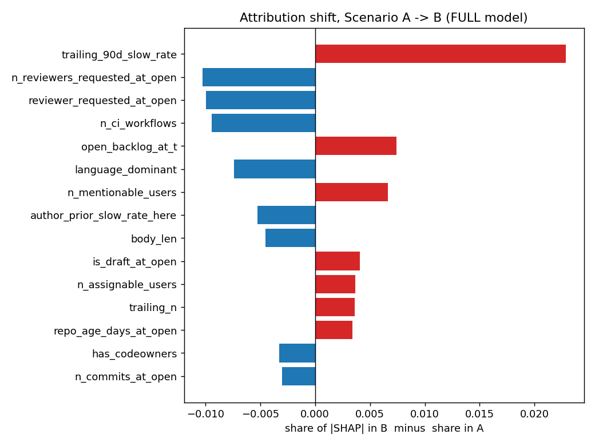
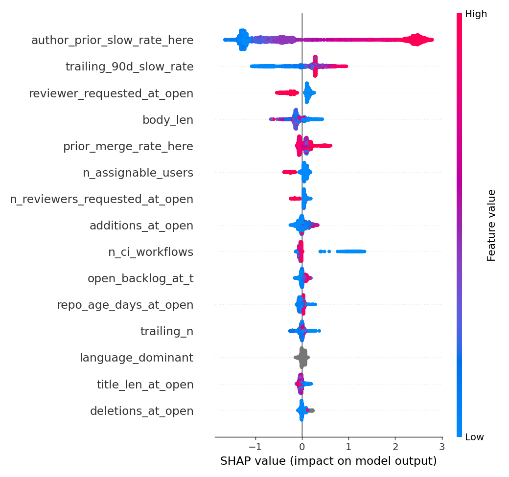
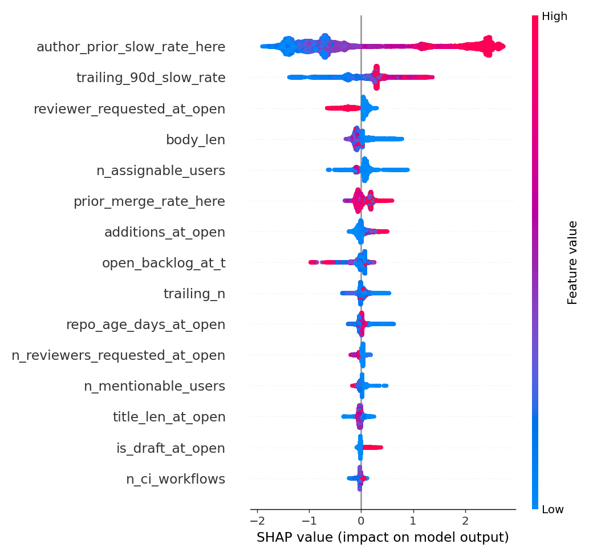
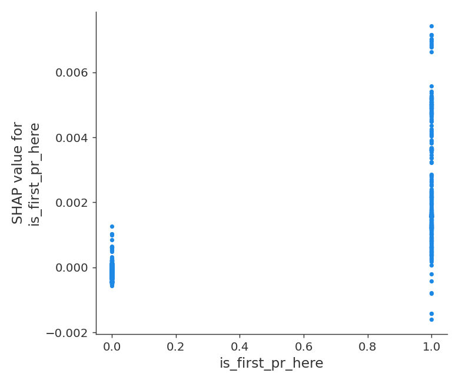
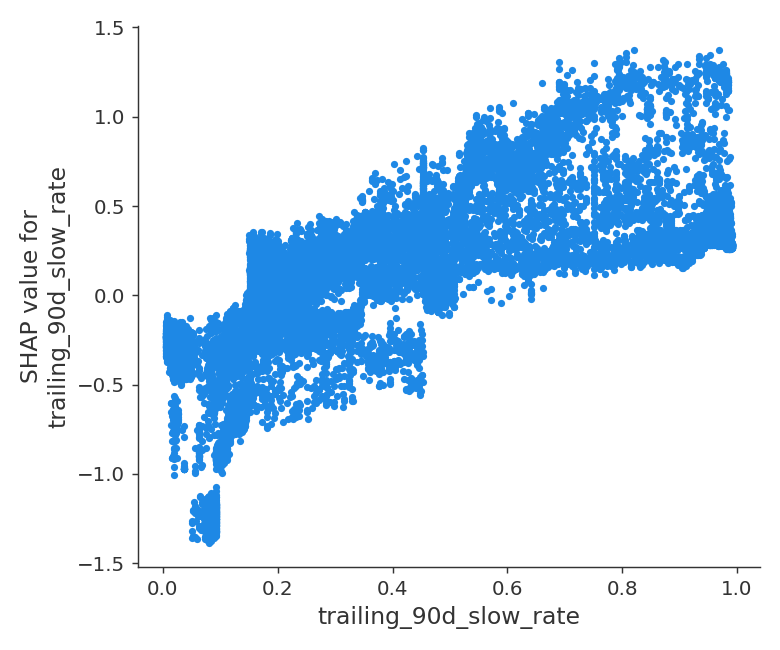

# Phase 6 — Interpretation, Error Analysis, Fairness

Generated by `report6.py`. Exact TreeSHAP over the Phase 4 boosters; nothing retrained.
5,000 explained rows per scenario (seeded sample).

## Gate: **PASS** (validity, not what the attributions say)

| id | check | value | pass |
|---|---|---|---|
| 1 | SHAP additivity vs raw margin (max |delta| < 1e-06) | {'A': 2.4424906541753444e-14, 'B': 4.529709940470639e-14, 'A_full': 3.064215547965432e-14} | True |
| 2 | sampling stability: two seeds' top-10 rankings agree (Spearman >= 0.9) | 1.0 | True |
| 3 | error rows come from Scenario A/FULL test set, 25 fp + 25 fn, labels match | {'n_fp': 25, 'n_fn': 25, 'unknown': [], 'mismatched': []} | True |
| 4 | every fairness CI is finite and computed from >= 2 repos | {'ci_finite': True, 'min_repos': 35} | True |
| 5 | all five data artifacts written and non-empty | {'shift': 37, 'importance_A': 37, 'importance_B': 37, 'worst50': 50, 'fairness': 12} | True |

## 1. Attribution shift, Scenario A -> B (FULL model)

`share` is each feature's mean-|SHAP| as a fraction of the scenario's total, so the two
scenarios are comparable despite different base rates and margins. `delta = share_b - share_a`.

| feature | share_a | share_b | delta |
|---|---|---|---|
| trailing_90d_slow_rate | 0.117 | 0.139 | 0.023 |
| n_reviewers_requested_at_open | 0.026 | 0.016 | -0.010 |
| reviewer_requested_at_open | 0.060 | 0.050 | -0.010 |
| n_ci_workflows | 0.019 | 0.010 | -0.009 |
| open_backlog_at_t | 0.015 | 0.022 | 0.007 |
| language_dominant | 0.013 | 0.006 | -0.007 |
| n_mentionable_users | 0.007 | 0.013 | 0.007 |
| author_prior_slow_rate_here | 0.473 | 0.468 | -0.005 |
| body_len | 0.043 | 0.039 | -0.005 |
| is_draft_at_open | 0.007 | 0.011 | 0.004 |
| n_assignable_users | 0.032 | 0.036 | 0.004 |
| trailing_n | 0.014 | 0.018 | 0.004 |
| repo_age_days_at_open | 0.014 | 0.018 | 0.003 |
| has_codeowners | 0.006 | 0.003 | -0.003 |
| n_commits_at_open | 0.009 | 0.007 | -0.003 |
| deletions_at_open | 0.012 | 0.010 | -0.003 |
| created_dayofweek | 0.006 | 0.009 | 0.002 |
| n_prior_merged_here | 0.006 | 0.007 | 0.001 |
| is_cross_repository | 0.001 | 0.002 | 0.001 |
| additions_at_open | 0.024 | 0.024 | -0.001 |

## 2. The cold-start mechanism

**The label-replay share is essentially unchanged between scenarios** (60.9% A vs 63.1% B, +2.2%). Attribution mass does not explain the cold-start gap; the difference must lie in how the same features behave on unseen repos rather than in which features are used.

Label-replay share: **Scenario A 60.9%**, **Scenario B 63.1%**.

## 3. What each model leans on

Scenario A, top 15:

| feature | mean_abs_shap | share |
|---|---|---|
| author_prior_slow_rate_here | 1.313 | 0.473 |
| trailing_90d_slow_rate | 0.323 | 0.117 |
| reviewer_requested_at_open | 0.166 | 0.060 |
| body_len | 0.120 | 0.043 |
| prior_merge_rate_here | 0.097 | 0.035 |
| n_assignable_users | 0.089 | 0.032 |
| n_reviewers_requested_at_open | 0.072 | 0.026 |
| additions_at_open | 0.068 | 0.024 |
| n_ci_workflows | 0.053 | 0.019 |
| open_backlog_at_t | 0.041 | 0.015 |
| repo_age_days_at_open | 0.040 | 0.014 |
| trailing_n | 0.039 | 0.014 |
| language_dominant | 0.036 | 0.013 |
| title_len_at_open | 0.036 | 0.013 |
| deletions_at_open | 0.034 | 0.012 |

Scenario B, top 15:

| feature | mean_abs_shap | share |
|---|---|---|
| author_prior_slow_rate_here | 1.281 | 0.468 |
| trailing_90d_slow_rate | 0.381 | 0.139 |
| reviewer_requested_at_open | 0.136 | 0.050 |
| body_len | 0.106 | 0.039 |
| n_assignable_users | 0.097 | 0.036 |
| prior_merge_rate_here | 0.096 | 0.035 |
| additions_at_open | 0.065 | 0.024 |
| open_backlog_at_t | 0.060 | 0.022 |
| trailing_n | 0.049 | 0.018 |
| repo_age_days_at_open | 0.049 | 0.018 |
| n_reviewers_requested_at_open | 0.043 | 0.016 |
| n_mentionable_users | 0.037 | 0.013 |
| title_len_at_open | 0.034 | 0.012 |
| is_draft_at_open | 0.031 | 0.011 |
| n_ci_workflows | 0.027 | 0.010 |

## 4. The 50 worst predictions (Scenario A, FULL)

25 most-confident false positives — the model said "this will stall", it did not:

| repo | number | url | p_hat | wait_h | top1_feature | top1_shap | top2_feature | top2_shap | top3_feature | top3_shap |
|---|---|---|---|---|---|---|---|---|---|---|
| radixark/miles | 617 | https://github.com/radixark/miles/pull/617 | 0.952 | 43.423 | author_prior_slow_rate_here | 2.419 | trailing_90d_slow_rate | 0.231 | body_len | 0.150 |
| radixark/miles | 602 | https://github.com/radixark/miles/pull/602 | 0.952 | 82.689 | author_prior_slow_rate_here | 2.501 | trailing_90d_slow_rate | 0.231 | body_len | 0.140 |
| projen/projen | 4485 | https://github.com/projen/projen/pull/4485 | 0.948 | 31.895 | author_prior_slow_rate_here | 2.343 | trailing_90d_slow_rate | 0.222 | prior_merge_rate_here | 0.170 |
| kdlbs/kandev | 330 | https://github.com/kdlbs/kandev/pull/330 | 0.948 | 0.391 | author_prior_slow_rate_here | 2.790 | trailing_90d_slow_rate | 0.292 | body_len | -0.142 |
| yunionio/cloudpods | 24917 | https://github.com/yunionio/cloudpods/pull/24917 | 0.945 | 0.001 | author_prior_slow_rate_here | 2.527 | trailing_90d_slow_rate | 0.290 | prior_merge_rate_here | 0.183 |
| yunionio/cloudpods | 24732 | https://github.com/yunionio/cloudpods/pull/24732 | 0.944 | 0.002 | author_prior_slow_rate_here | 2.487 | trailing_90d_slow_rate | 0.291 | prior_merge_rate_here | 0.203 |
| radixark/miles | 765 | https://github.com/radixark/miles/pull/765 | 0.944 | 0.064 | author_prior_slow_rate_here | 2.436 | trailing_90d_slow_rate | 0.197 | body_len | 0.165 |
| projen/projen | 4580 | https://github.com/projen/projen/pull/4580 | 0.944 | 6.151 | author_prior_slow_rate_here | 2.565 | prior_merge_rate_here | 0.201 | trailing_90d_slow_rate | 0.161 |
| kdlbs/kandev | 348 | https://github.com/kdlbs/kandev/pull/348 | 0.943 | 0.571 | author_prior_slow_rate_here | 2.512 | trailing_90d_slow_rate | 0.289 | prior_merge_rate_here | 0.179 |
| yunionio/cloudpods | 24429 | https://github.com/yunionio/cloudpods/pull/24429 | 0.943 | 0.002 | author_prior_slow_rate_here | 2.462 | trailing_90d_slow_rate | 0.293 | prior_merge_rate_here | 0.196 |
| yunionio/cloudpods | 25079 | https://github.com/yunionio/cloudpods/pull/25079 | 0.939 | 0.002 | author_prior_slow_rate_here | 2.415 | trailing_90d_slow_rate | 0.289 | prior_merge_rate_here | 0.181 |
| radixark/miles | 681 | https://github.com/radixark/miles/pull/681 | 0.938 | 9.116 | author_prior_slow_rate_here | 2.382 | trailing_90d_slow_rate | 0.195 | body_len | 0.170 |
| yunionio/cloudpods | 24333 | https://github.com/yunionio/cloudpods/pull/24333 | 0.931 | 7.469 | author_prior_slow_rate_here | 2.499 | trailing_90d_slow_rate | 0.284 | body_len | -0.220 |
| radixark/miles | 749 | https://github.com/radixark/miles/pull/749 | 0.923 | 0.202 | author_prior_slow_rate_here | 2.469 | trailing_90d_slow_rate | 0.208 | body_len | -0.199 |
| kdlbs/kandev | 706 | https://github.com/kdlbs/kandev/pull/706 | 0.921 | 11.905 | author_prior_slow_rate_here | 2.493 | trailing_90d_slow_rate | 0.290 | body_len | -0.140 |
| radixark/miles | 763 | https://github.com/radixark/miles/pull/763 | 0.919 | 0.049 | author_prior_slow_rate_here | 2.467 | trailing_90d_slow_rate | 0.210 | body_len | -0.203 |
| bastani-inc/atomic | 1135 | https://github.com/bastani-inc/atomic/pull/1135 | 0.919 | 14.650 | author_prior_slow_rate_here | 2.346 | trailing_90d_slow_rate | 0.285 | trailing_n | -0.216 |
| bastani-inc/atomic | 1139 | https://github.com/bastani-inc/atomic/pull/1139 | 0.918 | 8.405 | author_prior_slow_rate_here | 2.353 | trailing_90d_slow_rate | 0.278 | trailing_n | -0.205 |
| kdlbs/kandev | 1073 | https://github.com/kdlbs/kandev/pull/1073 | 0.917 | 0.895 | author_prior_slow_rate_here | 2.329 | trailing_90d_slow_rate | 0.282 | trailing_n | -0.179 |
| bastani-inc/atomic | 1143 | https://github.com/bastani-inc/atomic/pull/1143 | 0.917 | 5.749 | author_prior_slow_rate_here | 2.346 | trailing_90d_slow_rate | 0.278 | trailing_n | -0.207 |
| bastani-inc/atomic | 1136 | https://github.com/bastani-inc/atomic/pull/1136 | 0.917 | 13.228 | author_prior_slow_rate_here | 2.339 | trailing_90d_slow_rate | 0.282 | trailing_n | -0.213 |
| bastani-inc/atomic | 1144 | https://github.com/bastani-inc/atomic/pull/1144 | 0.914 | 3.707 | author_prior_slow_rate_here | 2.346 | trailing_90d_slow_rate | 0.277 | trailing_n | -0.200 |
| bastani-inc/atomic | 1145 | https://github.com/bastani-inc/atomic/pull/1145 | 0.914 | 3.251 | author_prior_slow_rate_here | 2.331 | trailing_90d_slow_rate | 0.278 | trailing_n | -0.205 |
| bastani-inc/atomic | 1131 | https://github.com/bastani-inc/atomic/pull/1131 | 0.909 | 10.086 | author_prior_slow_rate_here | 2.467 | trailing_90d_slow_rate | 0.265 | trailing_n | -0.215 |
| radixark/miles | 880 | https://github.com/radixark/miles/pull/880 | 0.908 | 115.177 | author_prior_slow_rate_here | 2.074 | trailing_90d_slow_rate | 0.163 | reviewer_requested_at_open | 0.113 |

25 most-confident false negatives — the model said "this is fine", it stalled:

| repo | number | url | p_hat | wait_h | top1_feature | top1_shap | top2_feature | top2_shap | top3_feature | top3_shap |
|---|---|---|---|---|---|---|---|---|---|---|
| kubernetes/autoscaler | 9889 | https://github.com/kubernetes/autoscaler/pull/9889 | 0.048 | never reviewed | author_prior_slow_rate_here | -1.225 | trailing_90d_slow_rate | -0.757 | n_assignable_users | -0.278 |
| kubernetes/autoscaler | 9905 | https://github.com/kubernetes/autoscaler/pull/9905 | 0.048 | never reviewed | author_prior_slow_rate_here | -0.991 | trailing_90d_slow_rate | -0.897 | n_assignable_users | -0.299 |
| kubernetes-sigs/gateway-api-inference-extension | 2974 | https://github.com/kubernetes-sigs/gateway-api-inference-extension/pull/2974 | 0.048 | 723.713 | author_prior_slow_rate_here | -0.905 | trailing_90d_slow_rate | -0.797 | n_assignable_users | -0.304 |
| kubernetes/autoscaler | 9409 | https://github.com/kubernetes/autoscaler/pull/9409 | 0.050 | 244.710 | author_prior_slow_rate_here | -1.259 | trailing_90d_slow_rate | -0.673 | reviewer_requested_at_open | -0.237 |
| kubernetes/autoscaler | 9125 | https://github.com/kubernetes/autoscaler/pull/9125 | 0.050 | 198.721 | author_prior_slow_rate_here | -1.252 | trailing_90d_slow_rate | -0.731 | reviewer_requested_at_open | -0.253 |
| kubernetes/autoscaler | 9305 | https://github.com/kubernetes/autoscaler/pull/9305 | 0.051 | 1062.419 | author_prior_slow_rate_here | -1.343 | trailing_90d_slow_rate | -0.707 | reviewer_requested_at_open | -0.302 |
| kubernetes/autoscaler | 9904 | https://github.com/kubernetes/autoscaler/pull/9904 | 0.052 | 369.489 | author_prior_slow_rate_here | -1.069 | trailing_90d_slow_rate | -0.815 | n_assignable_users | -0.306 |
| kubernetes/autoscaler | 9317 | https://github.com/kubernetes/autoscaler/pull/9317 | 0.053 | 878.861 | author_prior_slow_rate_here | -1.193 | trailing_90d_slow_rate | -0.857 | n_assignable_users | -0.289 |
| kubernetes/autoscaler | 9071 | https://github.com/kubernetes/autoscaler/pull/9071 | 0.055 | 273.877 | author_prior_slow_rate_here | -1.189 | trailing_90d_slow_rate | -0.873 | n_assignable_users | -0.276 |
| kubernetes/autoscaler | 9331 | https://github.com/kubernetes/autoscaler/pull/9331 | 0.055 | 269.430 | author_prior_slow_rate_here | -1.217 | trailing_90d_slow_rate | -0.775 | n_assignable_users | -0.268 |
| kubernetes/autoscaler | 9408 | https://github.com/kubernetes/autoscaler/pull/9408 | 0.057 | 758.151 | author_prior_slow_rate_here | -1.090 | trailing_90d_slow_rate | -0.771 | n_assignable_users | -0.260 |
| kubernetes-sigs/gateway-api-inference-extension | 2975 | https://github.com/kubernetes-sigs/gateway-api-inference-extension/pull/2975 | 0.059 | 723.726 | author_prior_slow_rate_here | -0.893 | trailing_90d_slow_rate | -0.811 | n_assignable_users | -0.259 |
| kubernetes-sigs/gateway-api-inference-extension | 2211 | https://github.com/kubernetes-sigs/gateway-api-inference-extension/pull/2211 | 0.062 | 328.042 | author_prior_slow_rate_here | -1.191 | trailing_90d_slow_rate | -0.810 | reviewer_requested_at_open | -0.263 |
| kubernetes/autoscaler | 9561 | https://github.com/kubernetes/autoscaler/pull/9561 | 0.064 | 355.740 | author_prior_slow_rate_here | -1.054 | trailing_90d_slow_rate | -0.834 | reviewer_requested_at_open | -0.263 |
| kubernetes-sigs/gateway-api-inference-extension | 2660 | https://github.com/kubernetes-sigs/gateway-api-inference-extension/pull/2660 | 0.066 | 207.866 | author_prior_slow_rate_here | -1.197 | trailing_90d_slow_rate | -0.735 | n_assignable_users | -0.233 |
| kubernetes/autoscaler | 9049 | https://github.com/kubernetes/autoscaler/pull/9049 | 0.069 | 261.784 | author_prior_slow_rate_here | -1.254 | trailing_90d_slow_rate | -0.608 | reviewer_requested_at_open | -0.253 |
| kubernetes/autoscaler | 9553 | https://github.com/kubernetes/autoscaler/pull/9553 | 0.069 | 404.987 | author_prior_slow_rate_here | -1.231 | trailing_90d_slow_rate | -0.667 | reviewer_requested_at_open | -0.274 |
| kubernetes/autoscaler | 9888 | https://github.com/kubernetes/autoscaler/pull/9888 | 0.071 | never reviewed | author_prior_slow_rate_here | -0.975 | trailing_90d_slow_rate | -0.755 | reviewer_requested_at_open | -0.238 |
| kubernetes-sigs/gateway-api-inference-extension | 2976 | https://github.com/kubernetes-sigs/gateway-api-inference-extension/pull/2976 | 0.072 | 684.928 | author_prior_slow_rate_here | -0.867 | trailing_90d_slow_rate | -0.826 | n_assignable_users | -0.235 |
| kubernetes-sigs/gateway-api-inference-extension | 2412 | https://github.com/kubernetes-sigs/gateway-api-inference-extension/pull/2412 | 0.073 | 871.824 | author_prior_slow_rate_here | -1.203 | trailing_90d_slow_rate | -0.620 | reviewer_requested_at_open | -0.222 |
| kubernetes/autoscaler | 9044 | https://github.com/kubernetes/autoscaler/pull/9044 | 0.086 | 529.009 | author_prior_slow_rate_here | -1.261 | trailing_90d_slow_rate | -0.600 | reviewer_requested_at_open | -0.238 |
| kubernetes/autoscaler | 9858 | https://github.com/kubernetes/autoscaler/pull/9858 | 0.094 | never reviewed | author_prior_slow_rate_here | -1.174 | trailing_90d_slow_rate | -0.531 | reviewer_requested_at_open | -0.248 |
| kubernetes/autoscaler | 9187 | https://github.com/kubernetes/autoscaler/pull/9187 | 0.094 | 336.192 | author_prior_slow_rate_here | -1.261 | trailing_90d_slow_rate | -0.605 | reviewer_requested_at_open | -0.237 |
| Scottcjn/Rustchain | 133 | https://github.com/Scottcjn/Rustchain/pull/133 | 0.112 | never reviewed | author_prior_slow_rate_here | -1.286 | trailing_90d_slow_rate | -0.610 | reviewer_requested_at_open | 0.145 |
| Scottcjn/Rustchain | 253 | https://github.com/Scottcjn/Rustchain/pull/253 | 0.113 | 1081.125 | author_prior_slow_rate_here | -1.303 | trailing_90d_slow_rate | -0.599 | reviewer_requested_at_open | 0.148 |

### What the failures have in common

Feature values among the 50 worst versus the whole test set, as z-scores:

| feature | mean_worst | mean_all | z |
|---|---|---|---|
| n_assignable_users | 300.200 | 57.208 | 1.459 |
| n_mentionable_users | 596.380 | 246.650 | 1.208 |
| owner_is_org | 0.960 | 0.593 | 0.747 |
| has_codeowners | 0.180 | 0.484 | -0.609 |
| prs_opened_trailing_7d | 42.400 | 175.744 | -0.551 |
| trailing_n | 351.040 | 1030.373 | -0.540 |
| n_labels_at_open | 0.240 | 0.038 | 0.467 |
| prior_merge_rate_here | 0.859 | 0.735 | 0.457 |
| reviewer_requested_at_open | 0.460 | 0.262 | 0.452 |
| n_ci_workflows | 12.100 | 16.636 | -0.446 |
| repo_age_days_at_open | 1625.032 | 1071.796 | 0.442 |
| n_reviewers_requested_at_open | 0.920 | 0.492 | 0.411 |

All 25 confident false positives and all 25 confident false negatives share the same top-two drivers — `author_prior_slow_rate_here` (top1 in all 50 rows) and `trailing_90d_slow_rate` (top2 in 49/50) — just at opposite extremes: false positives have both near their ceiling (mean author-rate 0.958, mean trailing-rate 0.868) and were in fact resolved fast (median wait 5.7h, max 115h, well under the 168h cutoff), while false negatives have both near their floor (mean author-rate 0.182, mean trailing-rate 0.023) yet stalled. The false positives are spread across five repos (radixark/miles and bastani-inc/atomic each contribute 7, yunionio/cloudpods 5, kdlbs/kandev 4, projen/projen 2) — no single repo dominates that tail. The false negatives are much more concentrated: kubernetes/autoscaler supplies 17 of 25 and kubernetes-sigs/gateway-api-inference-extension another 6, so 23 of 25 (92%) come from two large, org-owned repos with unusually clean trailing histories that the model over-trusted. Contrary to the corpus-wide pattern where most slow PRs are never reviewed, only 5 of these 25 confident false negatives were never reviewed; the other 20 were reviewed, just very late (median 387h, up to 1,081h) — so here the model's error is underestimating review latency, not mistaking "never" for "fast". The error_patterns table's largest z-score, `n_assignable_users` (worst-50 mean 300 vs corpus mean 57, z=1.46), is a false-negative-specific effect: it occupies a top-3-to-5 SHAP slot in 22 of the 25 false negatives (almost always pushing the prediction further toward "fine", mean shap -0.23) and appears in none of the false positives, consistent with those PRs coming from large, well-staffed repos whose apparent capacity did not translate into a timely review this time.

## 5. Fairness (blueprint §4)

How `is_first_pr_here` moves the prediction, and how the top-shift feature behaves:

`actual_rate` and `mean_p_hat` below are PR-weighted means (averaged over individual PRs), while `gap`
and its confidence interval are repo-weighted — the per-repo gap is the bootstrap unit, matching every
other interval in this project. The two are on different weighting bases, so in this table
**`gap` does not equal `mean_p_hat - actual_rate`**; that is by construction, not an error, and the
columns are not meant to be subtracted against each other.

### Scenario A (within-project split, time cutoff)

| slice | level | n | n_repos | actual_rate | mean_p_hat | gap | gap_ci_lo | gap_ci_hi |
|---|---|---|---|---|---|---|---|---|
| is_first_pr_here | first-time | 1489 | 37 | 0.373 | 0.460 | -0.036 | -0.127 | 0.058 |
| is_first_pr_here | repeat | 12646 | 39 | 0.494 | 0.520 | -0.035 | -0.076 | 0.007 |
| hour_bucket | 00-06 | 3235 | 35 | 0.476 | 0.504 | -0.077 | -0.152 | -0.001 |
| hour_bucket | 06-12 | 3786 | 38 | 0.505 | 0.517 | -0.041 | -0.101 | 0.024 |
| hour_bucket | 12-18 | 3557 | 37 | 0.447 | 0.513 | -0.054 | -0.109 | -0.001 |
| hour_bucket | 18-24 | 3557 | 36 | 0.496 | 0.522 | -0.085 | -0.142 | -0.029 |

### Scenario B (cold-start split, leave-repos-out)

| slice | level | n | n_repos | actual_rate | mean_p_hat | gap | gap_ci_lo | gap_ci_hi |
|---|---|---|---|---|---|---|---|---|
| is_first_pr_here | first-time | 3480 | 39 | 0.394 | 0.446 | 0.067 | 0.002 | 0.136 |
| is_first_pr_here | repeat | 34964 | 39 | 0.471 | 0.510 | 0.004 | -0.027 | 0.034 |
| hour_bucket | 00-06 | 8282 | 39 | 0.515 | 0.545 | -0.020 | -0.075 | 0.032 |
| hour_bucket | 06-12 | 11354 | 39 | 0.530 | 0.554 | 0.002 | -0.038 | 0.042 |
| hour_bucket | 12-18 | 10249 | 39 | 0.438 | 0.490 | 0.003 | -0.029 | 0.036 |
| hour_bucket | 18-24 | 8559 | 39 | 0.359 | 0.417 | 0.031 | -0.015 | 0.082 |

**Scenario A: no distinguishable newcomer gap.** The difference is -0.003 with CI [-0.091, 0.090], which contains zero — the model is not measurably more pessimistic about first-time contributors than about repeat ones, on 1,489 newcomer and 12,646 repeat rows.
**Scenario B: no distinguishable newcomer gap.** The difference is +0.064 with CI [-0.010, 0.143], which contains zero — the model is not measurably more pessimistic about first-time contributors than about repeat ones, on 3,480 newcomer and 34,964 repeat rows.
